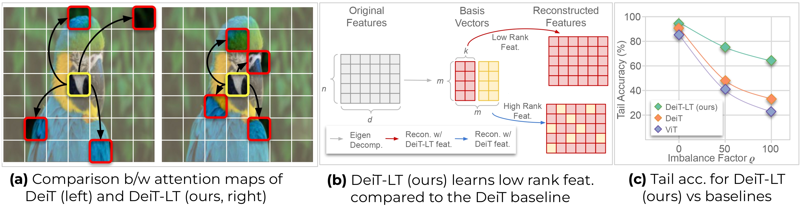

# DeiT-LT: Distillation strikes back for Vision Transformer training on Long-Tailed datasets

[](https://openaccess.thecvf.com/content/CVPR2024/papers/Rangwani_DeiT-LT_Distillation_Strikes_Back_for_Vision_Transformer_Training_on_Long-Tailed_CVPR_2024_paper.pdf)
[](https://arxiv.org/abs/2404.02900)
[](https://paperswithcode.com/sota/long-tail-learning-on-cifar-10-lt-r-50?p=deit-lt-distillation-strikes-back-for-vision)
[](https://paperswithcode.com/sota/long-tail-learning-on-cifar-10-lt-r-100?p=deit-lt-distillation-strikes-back-for-vision)

This repository contains the training, evaluation codes and checkpoints for the paper DeiT-LT: Distillation strikes back for Vision Transformer training on Long-Tailed datasets accepted at CVPR 2024. <br>



<!-- 
## Effect of distillation in DeiT-LT


A. We train DeiT-B with teachers trained on in-distribution images (RegNetY-16GF) and
out-of-distribution images (ResNet32). The out-of-distribution distillation leads to diverse experts, which become more diverse with deferred
re-weighting on the distillation token (DRW).

B. We plot the Mean Attention Distance for the patches across the early self attention block
1 (solid) and block 2 (dashed) for baselines, where we find that DeiT-LT leads to highly local and generalizable features.

C. We show the
rank of features for DIST token, where we demonstrate that students trained with SAM are more low-rank in comparison to baselines -->


## Usage

1. Clone the respository.
```
git clone https://github.com/val-iisc/DeiT-LT.git
```

2. CIFAR-10 and CIFAR-100 datasets are downloaded on its own through the code. However, in case of [Imagenet-LT](http://image-net.org/) and [iNaturalist-2018](https://github.com/visipedia/inat_comp/tree/master/2018), download these datasets from the given links.

3. Create the conda environment and activate it.

```
conda env create -f environment.yml
conda activate deitlt
```

4. Download the teacher models as given in Results table.

5. Run the corresponding training script for any dataset after adding teacher path in the script file for the argument `--teacher-path`. For example:
```
bash sh/train_c10_if100.sh
bash sh/train_imagenetlt.sh
```

6. For evaluation a DeiT-LT checkpoint, run the eval bash script for the corresponding dataset. Ensure that the checkpoint path is provided to the script for the argument `--resume`. For example: 
```
bash sh/eval_c10.sh
bash sh/eval_imagenetlt.sh
```

## Results

<table>
<tr>
<th>Dataset</th>
<th>Imbalance Factor</th>
<th>Overall</th>
<th>Head</th>
<th>Mid</th>
<th>Tail</th>
<th>Teacher path</th>
<th>Student path</th>
</tr>
<tr>
<td rowspan="2">CIFAR 10-LT</td>
<td>100</td>
<td>87.5</td>
<td>94.5</td>
<td>84.1</td>
<td>85.0</td>
<td><a href="https://api.wandb.ai/artifactsV2/default/pradipto611/QXJ0aWZhY3Q6Nzk3NzA4NTEx/3d5f8683cecaf84b2e4130f4f9d1f192/paco_sam_ckpt_cf10_if100.pth.tar">Link</a></td>
<td><a href="https://api.wandb.ai/artifactsV2/default/pradipto611/QXJ0aWZhY3Q6Nzk3NzA4NTEx/574dab8b51e97a8fca2b88d9f42e53c5/deit_base_distilled_patch16_224_resnet32_1200_CIFAR10LT_imb100_128_%5Bpaco_sam_teacher%5D_best_checkpoint.pth">Link</a></td>
</tr>
<tr>
<td>50</td>
<td>89.8</td>
<td>94.9</td>
<td>87.0</td>
<td>88.6</td>
<td><a href="https://api.wandb.ai/artifactsV2/default/pradipto611/QXJ0aWZhY3Q6Nzk3NzA4NTEx/fc15814c0ce158e6987110b256248e18/paco_sam_ckpt_cf10_if50.pth.tar">Link</a></td>
<td><a href="https://api.wandb.ai/artifactsV2/default/pradipto611/QXJ0aWZhY3Q6Nzk3NzA4NTEx/a1ee5cb061bb9e888dc54d84fa183a58/deit_base_distilled_patch16_224_resnet32_1200_CIFAR10LT_imb50_256_%5BIF50_paco_sam%5D_best_checkpoint.pth">Link</a></td>
</tr>
<tr>
<td rowspan="2">CIFAR 100-LT</td>
<td>100</td>
<td>55.6</td>
<td>72.8</td>
<td>55.4</td>
<td>31.4</td>
<td><a href="https://api.wandb.ai/artifactsV2/default/pradipto611/QXJ0aWZhY3Q6Nzk3NzA4NTEx/fc4a80f43013c11729e28426b64ef70b/cifar100_paco_sam_if100.pth.tar">Link</a></td>
<td><a href="https://api.wandb.ai/artifactsV2/default/pradipto611/QXJ0aWZhY3Q6Nzk3NzA4NTEx/cf0bdaca962d76f5d79be436478cfd5d/deit_base_distilled_patch16_224_resnet32_1200_CIFAR100LT_imb100_128_%5Bpaco_sam_teacher%5D_best_checkpoint.pth">Link</a></td>
</tr>
<tr>
<td>50</td>
<td>60.5</td>
<td>74.8</td>
<td>60.3</td>
<td>43.1</td>
<td><a href="https://api.wandb.ai/artifactsV2/default/pradipto611/QXJ0aWZhY3Q6Nzk3NzA4NTEx/f32d7dd157a9b2b27ff60f1900769ce0/cifar100_paco_sam_if50.pth.tar">Link</a></td>
<td><a href="https://api.wandb.ai/artifactsV2/default/pradipto611/QXJ0aWZhY3Q6Nzk3NzA4NTEx/69282bd245c8510b6edda1abb9459682/deit_base_distilled_patch16_224_resnet32_1200_CIFAR100LT_imb50_128_%5BIF50_paco_sam_teacher_cf100%5D_best_checkpoint.pth">Link</a></td>
</tr>
<tr>
<td>ImageNet-LT</td>
<td>-</td>
<td>59.1</td>
<td>66.6</td>
<td>58.3</td>
<td>40.0</td>
<td><a href="https://api.wandb.ai/artifactsV2/default/pradipto611/QXJ0aWZhY3Q6Nzk3Njk4NTk4/9bae08b41c6c4416e21e8250a955cdda/imagenetlt_paco_sam.pth.tar">Link</a></td>
<td><a href="https://api.wandb.ai/artifactsV2/default/pradipto611/QXJ0aWZhY3Q6Nzk3Njk4NTk4/79821d09b6603bdea5a18d957fd38b99/deit_base_distilled_patch16_224_resnet50_1400_IMAGENETLT_128_%5Bnew_paco_sam_teacher_flashv2%5D_best_checkpoint.pth">Link</a></td>
</tr>
<tr>
<td>iNaturalist-2018</td>
<td>-</td>
<td>75.1</td>
<td>70.3</td>
<td>75.2</td>
<td>76.2</td>
<td><a href="https://api.wandb.ai/artifactsV2/default/pradipto611/QXJ0aWZhY3Q6Nzk3Njk4NTk4/9db822ec842c5d6c6ada53ce686fe9a7/inat_paco_sam.pth.tar">Link</a></td>
<td><a href="https://api.wandb.ai/artifactsV2/default/pradipto611/QXJ0aWZhY3Q6Nzk3Njk4NTk4/5d643af66f1ca8f49de3ef6606166103/deit_base_distilled_patch16_224_resnet50_1000_INAT18_128_%5Bpaco_sam_teacher_long_schedule%5D_best_checkpoint.pth">Link</a></td>
</tr>
</table>


## Acknowledgement
This codebase is heavily inspired from [DeiT](https://github.com/facebookresearch/deit) (ICML 2021). The concepts and methodologies adopted from DeiT have been instrumental in enabling us to push the boundaries of our research and development. We extend our sincerest thanks to the developers and contributors of DeiT. 

## License
DeiT-LT is an open-source project released under the MIT license (MIT). The codebase is derived from that of DeiT (ICML 2021), which is released under [Apache 2.0 license](https://github.com/val-iisc/DeiT-LT/blob/main/LICENSE-FACEBOOK).

## BibTex
If you find this code or idea useful, please consider citing our work:
```
@InProceedings{Rangwani_2024_CVPR,
    author    = {Rangwani, Harsh and Mondal, Pradipto and Mishra, Mayank and Asokan, Ashish Ramayee and Babu, R. Venkatesh},
    title     = {DeiT-LT: Distillation Strikes Back for Vision Transformer Training on Long-Tailed Datasets},
    booktitle = {Proceedings of the IEEE/CVF Conference on Computer Vision and Pattern Recognition (CVPR)},
    month     = {June},
    year      = {2024},
    pages     = {23396-23406}
}
```
 
 
 
 

